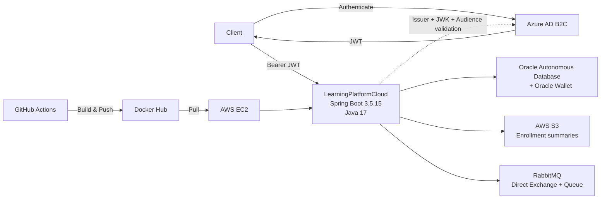

# LearningPlatformCloud

Cloud-oriented backend for an online learning platform, developed with **Java 17 and Spring Boot**, integrating relational persistence, object storage, messaging, OAuth2/JWT security, containerization and automated deployment across cloud services.

> Backend • Cloud • Security • Messaging • CI/CD

---

## 📌 Overview

**LearningPlatformCloud** is an academic backend project focused on the evolution of a traditional layered Spring Boot application into a cloud-oriented service.

The current version integrates:

- Oracle Autonomous Database with Oracle Wallet
- AWS S3 object storage
- Azure AD B2C authentication
- OAuth2 Resource Server and JWT validation
- RabbitMQ messaging
- Docker containerization
- GitHub Actions CI/CD
- Automated deployment to AWS EC2
- Spring Boot Actuator health monitoring

The project emphasizes **backend architecture, cloud integration, security, messaging and deployment automation**.

---

## 🏗️ Current Architecture



---

## ⚙️ Core Capabilities

### 📚 Courses

The API allows authenticated clients to:

- List available courses
- Create new courses
- Validate course data before persistence

### 📝 Enrollments

The enrollment flow supports:

- Student enrollment
- Association of multiple courses
- Calculation and persistence of enrollment totals
- Enrollment detail persistence

### ☁️ AWS S3

Enrollment summaries can be:

- Generated locally
- Uploaded to S3
- Updated by overwriting existing objects
- Downloaded
- Deleted

Object naming follows the structure:

```text
{inscripcionId}/Resumen_{inscripcionId}.txt
```

RabbitMQ evidence is stored separately as:

```text
mq/evidencia-rabbitmq.txt
```

### 📨 RabbitMQ

The application uses a durable queue with a direct exchange.

```text
Exchange:
learning.resumenes.exchange

Routing Key:
learning.resumenes.routing

Queue:
learning.resumenes.queue
```

The current implementation provides:

- Message production
- Queue state inspection
- API-triggered message consumption
- Persistence of consumed summaries in Oracle
- S3 evidence generation

The application is containerized together with RabbitMQ using **Docker Compose**, allowing both services to be started as part of the same local/cloud stack.

### 🔐 Azure AD B2C & JWT

The application is configured as an **OAuth2 Resource Server**.

JWT validation checks:

- Token signature through JWK
- Expected issuer
- Expected audience / Azure B2C Client ID

Public endpoints are limited to health and monitoring endpoints.

Authentication and access control are integrated with **Azure AD B2C**, with roles managed through Azure configuration.

---

## 🌐 API Endpoints

### Health

| Method | Endpoint | Authentication | Description |
|---|---|---:|---|
| `GET` | `/api/health` | Public | Application health information |
| `GET` | `/actuator/health` | Public | Spring Boot Actuator health |
| `GET` | `/actuator/info` | Public | Application information |

### Courses

| Method | Endpoint | Authentication | Description |
|---|---|---:|---|
| `GET` | `/api/cursos` | JWT | List courses |
| `POST` | `/api/cursos` | JWT | Create a course |

### Enrollments

| Method | Endpoint | Authentication | Description |
|---|---|---:|---|
| `GET` | `/api/inscripciones` | JWT | List enrollments |
| `POST` | `/api/inscripciones` | JWT | Create an enrollment |

### S3 Summaries

| Method | Endpoint | Authentication | Description |
|---|---|---:|---|
| `POST` | `/api/resumenes/{inscripcionId}/generar` | JWT | Generate summary locally |
| `POST` | `/api/resumenes/{inscripcionId}/upload` | JWT | Upload summary to AWS S3 |
| `PUT` | `/api/resumenes/{inscripcionId}/upload` | JWT | Update summary stored in S3 |
| `GET` | `/api/resumenes/{inscripcionId}/download` | JWT | Download summary from S3 |
| `DELETE` | `/api/resumenes/{inscripcionId}` | JWT | Delete summary from S3 |

### RabbitMQ

| Method | Endpoint | Authentication | Description |
|---|---|---:|---|
| `POST` | `/api/mq/resumenes/{inscripcionId}/enviar` | JWT | Send enrollment summary to RabbitMQ |
| `POST` | `/api/mq/resumenes/consumir` | JWT | Consume one message and persist it in Oracle |
| `GET` | `/api/mq/resumenes` | JWT | List consumed summaries |
| `GET` | `/api/mq/resumenes/estado-cola` | JWT | Inspect queue state |

---

## 🗄️ Data Model

The current application persists four main entities.

### `Curso`

Represents a course with:

- Name
- Instructor
- Duration
- Cost

### `Inscripcion`

Represents a student enrollment with:

- Student
- Total
- Enrollment date
- Enrollment details

### `DetalleInscripcion`

Associates an enrollment with its courses and stores the corresponding course cost.

A unique constraint prevents the same course from being duplicated inside the same enrollment.

### `ResumenCompraMq`

Stores enrollment summaries consumed from RabbitMQ, including:

- Enrollment ID
- Student
- Total
- Registered courses
- Summary content
- Messaging timestamps
- Processing state

---

## 🛠️ Technology Stack

### Backend

- Java 17
- Spring Boot 3.5.15
- Spring Web
- Spring Data JPA
- Spring Security
- Spring Validation
- Spring Boot Actuator
- Maven

### Security

- OAuth2 Resource Server
- JWT
- Azure AD B2C
- JWK validation
- Issuer validation
- Audience validation

### Data

- Oracle Autonomous Database
- Oracle Wallet
- Oracle JDBC
- Spring Data JPA
- Hibernate

### Cloud

- AWS S3
- AWS EC2
- Microsoft Azure AD B2C

### Messaging

- RabbitMQ
- AMQP
- Direct Exchange
- Durable Queue

### DevOps

- Docker
- Docker Compose
- Docker Hub
- GitHub Actions
- SSH-based EC2 deployment

---

## 🔄 CI/CD Pipeline

Every push to the `main` branch triggers the deployment workflow.

```text
Push to main
      │
      ▼
GitHub Actions
      │
      ├── Checkout
      ├── Configure Java 17
      ├── Maven package
      ├── Docker build
      └── Push image
             │
             ▼
         Docker Hub
             │
             ▼
        SSH deployment
             │
             ▼
           AWS EC2
             │
             ├── docker compose pull
             ├── docker compose down
             ├── docker compose up -d
             └── docker image prune
```

The Docker image is published as:

```text
ladyred/learningplatformcloud:latest
```

---

## 🔐 Configuration & Secrets

Secrets are **not stored in the repository**.

Local and deployment configuration is supplied through environment variables.

Create your local configuration from:

```bash
cp .env.example .env
```

Required variables include:

| Variable | Purpose |
|---|---|
| `ORACLE_TNS_ALIAS` | Oracle TNS connection alias |
| `ORACLE_WALLET_PATH` | Local Oracle Wallet path |
| `DB_USERNAME` | Oracle database username |
| `DB_PASSWORD` | Oracle database password |
| `AWS_REGION` | AWS region |
| `AWS_S3_BUCKET_NAME` | S3 bucket |
| `AZURE_B2C_CLIENT_ID` | Azure AD B2C application/client ID |
| `AZURE_B2C_ISSUER_URI` | JWT issuer |
| `AZURE_B2C_JWK_SET_URI` | JWK endpoint |
| `RABBITMQ_USERNAME` | RabbitMQ username |
| `RABBITMQ_PASSWORD` | RabbitMQ password |
| `RABBITMQ_QUEUE` | RabbitMQ queue |
| `RABBITMQ_EXCHANGE` | RabbitMQ exchange |
| `RABBITMQ_ROUTING_KEY` | RabbitMQ routing key |

AWS credentials are resolved through the **AWS SDK default credential provider chain** rather than being hardcoded in the application.

For AWS deployments, an IAM role or another supported credential source should be preferred.

---

## 🚀 Running Locally

### Requirements

- Java 17
- Maven Wrapper
- Docker
- Docker Compose
- Oracle Autonomous Database access
- Oracle Wallet
- AWS credentials with access to the configured S3 bucket
- Azure AD B2C configuration

Clone the repository:

```bash
git clone https://github.com/LadyRed145/LearningPlatformCloud_Grupo13.git
cd LearningPlatformCloud_Grupo13
```

Create your environment file:

```bash
cp .env.example .env
```

Configure the values in `.env`.

Then execute:

```fish
chmod +x scripts/run-local.fish
./scripts/run-local.fish
```

The script:

1. Loads local environment variables
2. Validates Oracle Wallet availability
3. Starts RabbitMQ through Docker Compose
4. Waits until RabbitMQ is ready
5. Starts the Spring Boot backend

Default backend address:

```text
http://localhost:8081
```

Health endpoint:

```text
http://localhost:8081/api/health
```

---

## 🧩 Engineering Evolution

LearningPlatformCloud evolved from an earlier backend implementation focused on a traditional layered architecture.

The previous stage included:

- CRUD-oriented backend development
- Oracle Autonomous Database
- Oracle Wallet integration
- Spring Data JPA
- Hibernate
- Spring Boot Actuator
- Functional API validation with Postman

The current version expanded that foundation toward cloud integration, external identity validation, object storage, messaging, containerization and automated deployment.

---

## 🧠 Engineering Challenges

Several technical issues were identified and resolved during the evolution of the project, including:

- Oracle Wallet dependency and path configuration
- Oracle JDBC security dependencies
- Hibernate query compatibility
- Oracle-specific data type constraints
- Duplicate Spring beans and package conflicts
- Duplicate REST context paths
- Repository and entity normalization
- Authentication architecture refactoring
- Environment portability between local and cloud deployments

These issues contributed to the progressive normalization and stabilization of the backend architecture.

---

## 🧪 Testing & Validation

Earlier development stages included functional API validation with **Postman**, covering HTTP operations and Oracle persistence.

The current automated test suite remains intentionally minimal and currently contains a Spring application-context test.

Expanding automated unit and integration coverage is part of the project's future technical improvement path.

---

## 📈 Future Improvements

- Expand unit and integration test coverage
- Integrate automated tests into CI
- Add container health checks
- Run the application container as a non-root user
- Introduce immutable Docker image tags
- Harden production-specific JPA settings
- Expand observability and monitoring
- Add OpenAPI documentation

---

## 🎓 Academic Context

This project was developed as part of backend development coursework at **Duoc UC, Chile**.

An earlier documented stage of the project was developed collaboratively by:

- **Natalia Alvarado**
- **Egor Llancapichun**

The repository reflects the technical evolution of the solution through different academic and cloud-integration stages.

---

## 👩‍💻 Profile

Developed and maintained as part of the technical portfolio of:

**Natalia Alvarado — LadyRed145**

[GitHub Profile](https://github.com/LadyRed145)
