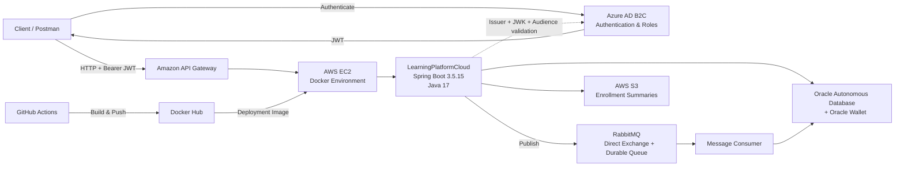

# LearningPlatformCloud

Cloud-oriented backend for an online learning platform, developed with **Java 17 and Spring Boot**, integrating relational persistence, object storage, asynchronous messaging, OAuth2/JWT security, containerization and cloud deployment.

> Backend • Cloud • Security • Messaging • CI/CD

---

## 📌 Overview

**LearningPlatformCloud** is an academic backend project focused on the evolution of a traditional layered Spring Boot application into a cloud-oriented service.

The implemented solution integrates:

- Oracle Autonomous Database with Oracle Wallet
- AWS S3 object storage
- Amazon API Gateway
- AWS EC2
- Azure AD B2C authentication and access control
- OAuth2 Resource Server and JWT validation
- RabbitMQ asynchronous messaging
- Docker and Docker Compose
- GitHub Actions CI/CD
- Docker Hub
- Spring Boot Actuator health monitoring

The project emphasizes **backend architecture, cloud integration, security, asynchronous messaging and deployment automation**.

> **Deployment status:** the AWS EC2 instance used during the academic deployment has since been decommissioned. The repository preserves the implementation and CI/CD workflow used during the project.

---

## 🏗️ Architecture

The deployed academic environment used **Amazon API Gateway** as the public entry point to the backend running on AWS EC2.



The RabbitMQ integration was incorporated into the existing cloud infrastructure while maintaining the communication flow through API Gateway, EC2, Oracle Cloud and AWS S3.

---

## ⚙️ Core Capabilities

### 📚 Courses

The API allows authenticated clients to:

- List available courses
- Create new courses
- Validate course data before persistence

### 📝 Enrollments

The enrollment flow supports:

- Student enrollment
- Association of multiple courses
- Calculation and persistence of enrollment totals
- Enrollment detail persistence

### ☁️ AWS S3

Enrollment summaries can be:

- Generated locally
- Uploaded to S3
- Updated by overwriting existing objects
- Downloaded
- Deleted

Object naming follows the structure:

```text
{inscripcionId}/Resumen_{inscripcionId}.txt
```

RabbitMQ evidence is stored separately as:

```text
mq/evidencia-rabbitmq.txt
```

---

## 📨 RabbitMQ

RabbitMQ was integrated as an asynchronous messaging service using **Spring AMQP**.

The topology consists of:

```text
Exchange:
learning.resumenes.exchange

Type:
direct

Routing Key:
learning.resumenes.routing

Queue:
learning.resumenes.queue
```

The implementation provides:

- Message production
- Direct exchange routing
- Durable queue storage
- Queue state inspection
- API-triggered message consumption
- Persistence of consumed summaries in Oracle
- S3 evidence generation

The backend publishes each enrollment summary to the configured exchange using the routing key.

RabbitMQ evaluates the routing key and forwards the message through the corresponding binding to:

```text
learning.resumenes.queue
```

where it remains available until it is processed.

### Docker Integration

The application and RabbitMQ are containerized using **Docker and Docker Compose**, allowing the services to operate together as part of the same deployment stack.

RabbitMQ uses:

```text
5672  → AMQP communication
15672 → RabbitMQ Management
```

During the academic cloud deployment, RabbitMQ Management was also validated remotely through an SSH tunnel to the EC2 instance.

---

## 🔐 Azure AD B2C & JWT

The backend is configured as an **OAuth2 Resource Server**.

JWT validation includes:

- Token signature validation through JWK
- Expected issuer validation
- Expected audience validation
- Azure AD B2C Client ID validation

Public access is limited to health and monitoring endpoints.

Authentication and access control are integrated with **Azure AD B2C**, with roles managed through Azure configuration.

Business endpoints require authenticated requests.

---

## 🌐 Amazon API Gateway

During the deployed cloud environment, **Amazon API Gateway** acted as the public entry point to the API.

The general request flow was:

```text
Client / Postman
        │
        ▼
Amazon API Gateway
        │
        ▼
AWS EC2
        │
        ▼
Spring Boot
```

API Gateway exposed the application endpoints while the backend services operated inside the EC2 deployment environment.

---

## 🌐 API Endpoints

### Health

| Method | Endpoint | Authentication | Description |
|---|---|---:|---|
| `GET` | `/api/health` | Public | Application health information |
| `GET` | `/actuator/health` | Public | Spring Boot Actuator health |
| `GET` | `/actuator/info` | Public | Application information |

### Courses

| Method | Endpoint | Authentication | Description |
|---|---|---:|---|
| `GET` | `/api/cursos` | JWT | List courses |
| `POST` | `/api/cursos` | JWT | Create a course |

### Enrollments

| Method | Endpoint | Authentication | Description |
|---|---|---:|---|
| `GET` | `/api/inscripciones` | JWT | List enrollments |
| `POST` | `/api/inscripciones` | JWT | Create an enrollment |

### S3 Summaries

| Method | Endpoint | Authentication | Description |
|---|---|---:|---|
| `POST` | `/api/resumenes/{inscripcionId}/generar` | JWT | Generate summary locally |
| `POST` | `/api/resumenes/{inscripcionId}/upload` | JWT | Upload summary to AWS S3 |
| `PUT` | `/api/resumenes/{inscripcionId}/upload` | JWT | Update summary stored in S3 |
| `GET` | `/api/resumenes/{inscripcionId}/download` | JWT | Download summary from S3 |
| `DELETE` | `/api/resumenes/{inscripcionId}` | JWT | Delete summary from S3 |

### RabbitMQ

| Method | Endpoint | Authentication | Description |
|---|---|---:|---|
| `POST` | `/api/mq/resumenes/{inscripcionId}/enviar` | JWT | Send enrollment summary to RabbitMQ |
| `POST` | `/api/mq/resumenes/consumir` | JWT | Consume one message and persist it in Oracle |
| `GET` | `/api/mq/resumenes` | JWT | List consumed summaries |
| `GET` | `/api/mq/resumenes/estado-cola` | JWT | Inspect queue state |

---

## 🗄️ Data Model

The current application persists four main entities.

### `Curso`

Represents a course with:

- Name
- Instructor
- Duration
- Cost

### `Inscripcion`

Represents a student enrollment with:

- Student
- Total
- Enrollment date
- Enrollment details

### `DetalleInscripcion`

Associates an enrollment with its courses and stores the corresponding course cost.

A unique constraint prevents the same course from being duplicated inside the same enrollment.

### `ResumenCompraMq`

Stores enrollment summaries consumed from RabbitMQ, including:

- Enrollment ID
- Student
- Total
- Registered courses
- Summary content
- Messaging timestamps
- Processing state

---

## 🛠️ Technology Stack

### Backend

- Java 17
- Spring Boot 3.5.15
- Spring Web
- Spring Data JPA
- Spring Security
- Spring Validation
- Spring Boot Actuator
- Maven

### Security

- OAuth2 Resource Server
- JWT
- Azure AD B2C
- JWK validation
- Issuer validation
- Audience validation
- Azure-managed access control

### Data

- Oracle Autonomous Database
- Oracle Wallet
- Oracle JDBC
- Spring Data JPA
- Hibernate

### Cloud

- Amazon API Gateway
- AWS EC2
- AWS S3
- Microsoft Azure AD B2C
- Oracle Cloud

### Messaging

- Spring AMQP
- RabbitMQ
- AMQP
- Direct Exchange
- Routing Key
- Durable Queue

### DevOps

- Docker
- Docker Compose
- Docker Hub
- GitHub Actions
- Git
- GitHub
- SSH-based EC2 deployment

### Testing & Validation

- Postman
- RabbitMQ Management
- Spring Boot Actuator

---

## 🔄 CI/CD Pipeline

The repository contains the GitHub Actions workflow used during the active cloud deployment.

```text
Push to main
      │
      ▼
GitHub Actions
      │
      ├── Checkout
      ├── Configure Java 17
      ├── Maven package
      ├── Docker build
      └── Push image
             │
             ▼
         Docker Hub
             │
             ▼
        SSH deployment
             │
             ▼
           AWS EC2
             │
             ├── docker compose pull
             ├── docker compose down
             ├── docker compose up -d
             └── docker image prune
```

The Docker image was published as:

```text
ladyred/learningplatformcloud:latest
```

> The original EC2 deployment environment has been decommissioned after completion of the academic project. The workflow remains in the repository as part of the project's implementation history.

---

## ⚙️ Runtime Configuration

The application uses environment variables for multiple infrastructure and authentication settings.

Relevant configuration includes:

| Variable | Purpose |
|---|---|
| `DB_URL` | Oracle database connection |
| `DB_USERNAME` | Oracle database username |
| `DB_PASSWORD` | Oracle database password |
| `AWS_REGION` | AWS region |
| `AWS_S3_BUCKET_NAME` | S3 bucket |
| `AZURE_B2C_CLIENT_ID` | Azure AD B2C application/client ID |
| `AZURE_B2C_ISSUER_URI` | JWT issuer |
| `AZURE_B2C_JWK_SET_URI` | JWK endpoint |
| `RABBITMQ_HOST` | RabbitMQ host |
| `RABBITMQ_PORT` | RabbitMQ AMQP port |
| `RABBITMQ_USERNAME` | RabbitMQ username |
| `RABBITMQ_PASSWORD` | RabbitMQ password |
| `RABBITMQ_QUEUE` | RabbitMQ queue |
| `RABBITMQ_EXCHANGE` | RabbitMQ exchange |
| `RABBITMQ_ROUTING_KEY` | RabbitMQ routing key |

The local Fish startup script loads environment-specific values and starts RabbitMQ before launching the Spring Boot backend.

---

## 🚀 Running Locally

### Requirements

- Java 17
- Maven Wrapper
- Docker
- Docker Compose
- Oracle Autonomous Database access
- Oracle Wallet
- AWS credentials with access to the configured S3 bucket
- Azure AD B2C configuration

Clone the repository:

```bash
git clone https://github.com/LadyRed145/LearningPlatformCloud.git
cd LearningPlatformCloud
```

Configure the required local environment values.

Then execute:

```fish
chmod +x scripts/run-local.fish
./scripts/run-local.fish
```

The local script:

1. Stops previous Docker services to avoid port conflicts
2. Loads database configuration
3. Loads AWS configuration
4. Loads Azure AD B2C configuration
5. Loads RabbitMQ configuration
6. Starts the RabbitMQ container
7. Starts the Spring Boot backend

The backend runs locally on:

```text
http://localhost:8081
```

Health endpoint:

```text
http://localhost:8081/api/health
```

---

## 🧩 Engineering Evolution

LearningPlatformCloud evolved from an earlier backend implementation focused on a traditional layered architecture.

The previous stage included:

- CRUD-oriented backend development
- Oracle Autonomous Database
- Oracle Wallet integration
- Spring Data JPA
- Hibernate
- Spring Boot Actuator
- Functional API validation with Postman

The solution was later expanded toward a cloud-oriented architecture incorporating:

- Amazon API Gateway
- AWS EC2
- AWS S3
- Azure AD B2C
- OAuth2/JWT
- RabbitMQ
- Docker
- Docker Compose
- GitHub Actions
- Docker Hub

This evolution allowed the project to move from a traditional backend implementation toward a distributed cloud deployment with external authentication, object storage, asynchronous messaging and automated delivery.

---

## 🧠 Engineering Challenges

Several technical issues were identified and resolved throughout the project's evolution, including:

- Oracle Wallet dependency and path configuration
- Oracle JDBC security dependencies
- Hibernate query compatibility
- Oracle-specific data type constraints
- Duplicate Spring beans and package conflicts
- Duplicate REST context paths
- Repository and entity normalization
- Authentication architecture refactoring
- Integration of cloud services
- Messaging topology configuration
- RabbitMQ routing and queue validation
- Environment portability between local and cloud deployments

These challenges contributed to the progressive normalization and stabilization of the backend architecture.

---

## 🧪 Testing & Validation

Functional testing was performed with **Postman** against endpoints exposed through Amazon API Gateway.

RabbitMQ validation included:

- Sending summaries from multiple enrollments
- Confirming independent message generation
- Inspecting the queue state through the API
- Comparing the reported queue state with RabbitMQ Management
- Verifying messages directly from the RabbitMQ container deployed on EC2

During the final validation, three independent enrollment summaries were sent to RabbitMQ and the queue-monitoring endpoint reported three pending messages.

The result was verified against both **RabbitMQ Management** and the deployed container, confirming that the messages had been correctly routed and stored.

Earlier project stages also included functional validation of HTTP operations and Oracle persistence using Postman.

The current automated test suite contains a Spring application-context test.

---

## 📈 Future Improvements

- Expand unit and integration test coverage
- Integrate automated tests into CI
- Add container health checks
- Expand observability and monitoring
- Add OpenAPI documentation
- Introduce additional production-hardening practices

---

## 🎓 Academic Context

This project was developed as part of the **Analista Programador** program at **Duoc UC, Chile**.

The cloud-native implementation was developed during the **Desarrollo Cloud Native (CDY2204)** course.

The project was developed collaboratively by:

- **Natalia Alvarado**
- **Egor Llancapichun**

The repository reflects the technical evolution of the solution through different backend and cloud-integration stages.

---

## 📚 Documentation

The repository README consolidates the implemented architecture, cloud integrations, messaging flow, endpoints, testing and deployment history of the project.

Additional technical documentation can be maintained inside the:

```text
docs/
```

📄 [Final Technical Report](./docs/LearningPlatformCloud_Documentacion_Final.pdf)

---

## 👩‍💻 Profile

Developed and maintained as part of the technical portfolio of:

**Natalia Alvarado — LadyRed145**

[GitHub Profile](https://github.com/LadyRed145)
